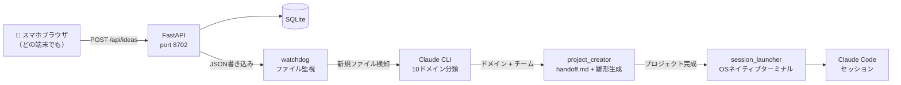

# idea-receiver

> スマホで気になるものを見つけた。試してみたい。
> でも自分のデスクに戻った頃には、忘れている。
>
> **idea-receiver はその問題を解く。**
> スマホから1タップ → Claude Code が自動でプロジェクトを立ち上げ、あなたが着席する前に準備完了。

[](https://www.python.org/)
[](https://fastapi.tiangolo.com/)
[](#-ライセンス)
[](https://webauthn.io/)
[]()

English README → [README.md](README.md)

---

## ✨ できること

スマホからアイデアを1タップで送信 → 翌朝には AI チームが組成されたプロジェクトが起動済み。

| 課題 | idea-receiver の解決策 |
|------|----------------------|
| 📱 外出中に良いアイデアを思いついても、帰宅した頃には忘れている | スマホブラウザから1タップで送信。オフライン時は自動保存し、復帰後に同期 |
| ⏱️ 「アイデアを思いついた」から「実際に着手」まで数日〜永遠にかかる | 自動分類 → プロジェクト雛形生成 → Claude Code セッション起動。設定より実行 |
| 🔍 「このアイデア、すでに誰かやってる？どこが最前線？」 | **系譜分析（Genealogy Analysis）** をフェーズ0で自動実施。技術の歴史を辿り、あなたのプロジェクトが取り組むべき未開拓領域を特定 |
| 🔗 GitHub リポジトリや記事の URL を見つけた、自分のプロジェクトに使えるか試したい | URL をアイデアに含めて送るだけ。コンテンツを自動取得し、導入提案を生成 |

---

## 🎬 デモ

```
📱 スマホ: 「習慣トラッカーに AI で失敗原因分析を追加したい」
        ↓  （送信ボタンをタップ）
🤖 Claude: 分類中... → automation ドメイン → Clockwork チーム
        ↓
📁 プロジェクト作成: ~/dev/intelligence/002_habit_root_cause_analyzer/
        ↓  系譜分析フレームワーク付き handoff.md を生成
💻 Claude Code セッションが自動起動
        ↓
🧬 Phase 0: 系譜分析 — 「習慣トラッキング」の技術史を調査し、
   あなたのプロジェクトが攻めるべき未開拓領域を提案
```

---

## 🏗️ アーキテクチャ



**設計の要点:**
- **ファイルベースパイプライン**: `watchdog` が `data/ideas/` を監視。メッセージキュー不要
- **Claude CLI サブプロセス**: `claude -p` をスレッドプールで実行（Windows async の制約を回避）
- **URL 事前取得**: アイデアに含まれる URL を分類前に取得（SSRF 対策済み）。GitHub URL を貼るだけで Claude がコードを読んで提案
- **アトミック DB クレーム**: `UPDATE WHERE status='received'` で同一アイデアの二重処理を防止

---

## 🚀 クイックスタート

```bash
git clone https://github.com/Rinamo2026/claude-code-idea-receiver
cd idea-receiver
python -m venv .venv

# Linux / macOS
source .venv/bin/activate && bash start.sh

# Windows
.venv\Scripts\activate.bat && start_silent.bat
```

ブラウザで `http://localhost:8702` を開き、最初のアイデアを送信。

> **必須**: `claude` CLI が PATH に通っていること。
> [claude.ai/code](https://claude.ai/code) からインストール。

---

## ⚙️ 設定

**ローカル利用ならデフォルト設定のまま動きます。** カスタマイズが必要な場合のみ `.env` を作成:

```env
# プロジェクト作成先ディレクトリ（デフォルト: ./projects/）
# 実運用時は自分の開発ルートに設定:
DEV_ROOT=/home/yourname/dev

# ポート（デフォルト: 8702）
# IDEA_RECEIVER_PORT=8702
```

デフォルトでは `idea-receiver/projects/` にプロジェクトが作成されます。`DEV_ROOT` を設定するとそこに切り替わります。
WebAuthn の `RP_ID` / `ORIGIN` はデフォルトで `localhost` が設定済みです。

<details>
<summary>詳細オプション</summary>

デフォルトでは同梱の `templates/init-project.sh` でプロジェクトを初期化します
（git init, memory/, .gitignore, CLAUDE.md, handoff.md, .claude/）。
テンプレートを直接編集するか、独自スクリプトを指定できます:

```env
# 独自の初期化スクリプトで上書き（任意）
# 呼び出し形式: bash $INIT_PROJECT_SCRIPT <project_path> --git
INIT_PROJECT_SCRIPT=/path/to/my-init-project.sh

# Git Bash パス — Windows のみ、通常は自動検出
GIT_BASH=C:/Program Files/Git/bin/bash.exe
```

</details>

> **外出先（外部ネットワーク）からアクセスしたい場合**（通勤中・カフェ等）:
> Tailscale Funnel / ngrok / WireGuard / Cloudflare Tunnel のセットアップ手順は [docs/networking.md](docs/networking.md) を参照してください。

---

## 🗂️ 10 ドメイン

送信されたアイデアは以下の10ドメインに自動分類されます。各ドメインには専用の AI チーム（系譜研究員・批判的レビュアー・プロンプトアーキテクト + ドメイン専門家）が編成されます。

| ドメイン | チーム | 対象領域 |
|---------|------|---------|
| `automation` | **Clockwork** | 自動化・パイプライン・効率化 |
| `business` | **Venture** | ビジネスモデル・起業・戦略 |
| `research` | **Scholar** | 調査・分析・学術研究 |
| `development` | **Forge** | ソフトウェア開発・OSS |
| `creative` | **Muse** | デザイン・執筆・音楽・映像 |
| `intelligence` | **Nexus** | AI・機械学習・LLM応用 |
| `infrastructure` | **Bastion** | DevOps・システム・クラウド |
| `education` | **Academy** | 学習ツール・教材・チュータリング |
| `social` | **Agora** | コミュニティ・SNS・コミュニケーション |
| `data_ai` | **Prism** | データ分析・BI・ダッシュボード |

各ドメインはそのチームのワークフローに最適化された `handoff.md` を生成します:
- **Phase 0（系譜分析）**: アイデアの技術史を調査し、最前線と未開拓領域を特定
- **Phase 1〜4**: プロセス分析 → 設計 → 実装 → 運用
- **Innovation Gate**: 実装前の構造化された Go/No-Go レビュー

---

## 🧬 系譜分析（Genealogy Analysis）

コードを書く前に、必ず系譜分析を実施します:

```
📖 「このアイデアはどこから来たのか？」
   → 要素分解 → 技術史を調査 → 現在の最前線を特定
   → 未開拓領域をマッピング
   → 他分野の類似解決策を調査（クロスドメイン注入）
   → 「あなたのプロジェクトが次に進むべき場所」のナラティブを生成
```

これにより、ゼロから始めることなく、既存の取り組みを無意識に再発明することもなくなります。

---

## 🔒 認証

**WebAuthn（パスキー）** を使用。デバイスを一度登録すると、生体認証や PIN で認証できます。

- ローカル直接接続（同一マシン）: 認証を自動バイパス
- プロキシ経由（Tailscale, ngrok）: WebAuthn 認証が必要
- 複数デバイス: 初回セットアップ後にログイン済み状態でそれぞれ登録

---

## 🖥️ プラットフォーム別の動作

| OS | ターミナル | セッション起動方法 |
|----|---------|----------------|
| Windows | Windows Terminal (`wt.exe`) | 新しい仮想デスクトップに新規タブ |
| macOS | iTerm2（優先）または Terminal.app | AppleScript で新規ウィンドウ |
| Linux | gnome-terminal / konsole / xterm | 順番に探索し、最初に見つかったものを使用 |

ターミナルが見つからない場合でも、パイプラインは完了します（プロジェクトと handoff.md は作成済み）。手動で起動: `cd <project_path> && claude`

---

## 📁 プロジェクト構造

```
idea-receiver/
├── main.py              # FastAPI アプリ — Ideas API・認証・WebSocket
├── classifier.py        # Claude CLI 分類器（10ドメイン・URL事前取得）
├── domains.py           # ドメイン定義・チーム編成・フェーズテンプレート
├── project_creator.py   # 雛形生成 — handoff.md・CLAUDE.md・設定ファイル
├── watcher.py           # watchdog パイプライン — 分類 → 作成 → 起動
├── session_launcher.py  # OS ネイティブターミナル + Claude Code セッション起動
├── auth.py              # WebAuthn 登録・認証
├── config.py            # 環境変数設定
├── models.py            # SQLite モデル (aiosqlite)
├── static/              # Web UI（フレームワークなし素の JS）
├── templates/           # Jinja2 — handoff.md.j2
└── data/
    └── examples/        # サンプルアイデア JSON（出力イメージの確認用）
```

---

## 📋 必要環境

- Python 3.11+
- [Claude CLI](https://claude.ai/code) — `claude` が PATH に通っていること
- Git

任意:
- Bash（Windows では Git Bash）— 同梱の `templates/init-project.sh` によるリッチなスキャフォールドに使用。なくても組み込みフォールバックで動作

---

## 🔧 自分のワークフローに合わせてカスタマイズ

idea-receiver はプロジェクトごとに `CLAUDE.md` と `handoff.md` を生成し、Claude Code の動作を設定します。これらを編集して自分のワークフローに合わせることができます:

| カスタマイズ対象 | ファイル | 例 |
|----------------|---------|---|
| チームの役割・専門性 | `domains.py` | infrastructure ドメインに「セキュリティ監査員」を追加 |
| フェーズ定義 | `domains.py` | Phase 3（実装）を TDD ファーストのワークフローに変更 |
| Innovation Gate の基準 | `domains.py` | ドメインごとに Go/No-Go の閾値を調整 |
| 系譜分析の深度 | `domains.py` | research ドメインで要素上限を 4 → 6 に拡大 |
| プロジェクト雛形テンプレート | `templates/` | 独自の `CLAUDE.md` テンプレートにチームルールを追加 |

`domains.py` の各ドメインは独立しており、1つを編集しても他に影響しません。スキーマの詳細は `DomainConfig` データクラスを参照してください。

---

## 🤝 コントリビューション

セットアップ・コードスタイル・PR ガイドラインは [CONTRIBUTING.md](.github/CONTRIBUTING.md) を参照。

特にウェルカムな貢献:
- **新ドメインの追加** — `domains.py` にドメイン定義を追加
- **ターミナルサポートの改善** — macOS / Linux のセッション起動
- **モバイル UI の改善** — Web UI は意図的にミニマル構成
- **Docker 対応** — `Dockerfile` があるとセットアップが大幅に楽になります

---

## 🗺️ ロードマップ

- [ ] Docker 対応（コマンド1行でセットアップ）
- [ ] ウェブベースのセッションランチャー（ネイティブターミナル依存なし）
- [ ] マルチユーザー対応
- [ ] プロジェクト作成時の Webhook / プッシュ通知
- [ ] Notion / Obsidian へのエクスポート

---

## 📄 ライセンス

MIT — [LICENSE](LICENSE) を参照。
