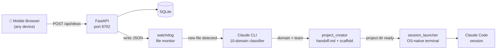

# idea-receiver

> You spot something on your phone. You want to try it.
> By the time you're at your desk — you've forgotten.
>
> **idea-receiver fixes that.**
> One tap from your phone → Claude Code auto-scaffolds a project before you sit down.

[](https://www.python.org/)
[](https://fastapi.tiangolo.com/)
[](#-license)
[](https://webauthn.io/)
[]()

---

## ✨ What this does

Capture a fleeting idea from your phone → wake up to a fully scaffolded AI-team project, ready to execute.

| Problem | How idea-receiver solves it |
|---------|---------------------------|
| 📱 Great idea on your phone, forgotten by the time you're at your desk | 1-tap capture from any mobile browser. Offline? Auto-syncs when back online. |
| ⏱️ Time between "idea" and "actually starting" is days or never | Auto-classifies → generates project scaffold → opens Claude Code session. You start working, not setting up. |
| 🔍 "Is this idea already done? Where's the frontier?" | Each project gets a **genealogy analysis**: Claude traces the idea's lineage, finds the state-of-the-art, and proposes where _your_ project goes next. |
| 🔗 Found a cool GitHub repo or article, want to adopt it | Paste the URL into your idea. The content is fetched automatically and used to generate an adoption proposal. |

---

## 🎬 Demo

```
📱 Phone: "Build a habit tracker with AI root-cause analysis"
        ↓  (tap Submit)
🤖 Claude: classifying... → automation domain → Clockwork team
        ↓
📁 Project created: ~/dev/intelligence/002_habit_root_cause_analyzer/
        ↓  handoff.md generated with genealogy framework
💻 Claude Code session opens automatically
        ↓
🧬 Phase 0: Genealogy analysis — "habit tracking" lineage traced,
   frontier identified, your differentiation angle proposed
```

---

## 🏗️ Architecture



**Key design choices:**
- **File-based pipeline**: `watchdog` monitors `data/ideas/` for new JSON files — no message queue needed
- **Claude CLI subprocess**: classification runs via `claude -p` in a thread pool (Windows async workaround)
- **URL prefetch**: URLs in idea text are fetched before classification (SSRF-protected), so pasting a GitHub link gives Claude full context
- **Atomic DB claim**: `UPDATE WHERE status='received'` ensures only one process handles each idea, even under concurrent restarts

---

## 🚀 Quick Start

```bash
git clone https://github.com/Rinamo2026/claude-code-idea-receiver
cd idea-receiver
python -m venv .venv

# Linux / macOS
source .venv/bin/activate && bash start.sh

# Windows
.venv\Scripts\activate.bat && start_silent.bat
```

Open `http://localhost:8702` in your browser and submit your first idea.

> **Prerequisite**: `claude` CLI must be in your PATH.
> Install it from [claude.ai/code](https://claude.ai/code).

---

## ⚙️ Configuration

**Works out of the box for local use.** Create a `.env` file only if you need to customize:

```env
# Where Claude creates new project directories (default: ./projects/)
# Set this to your own dev root for real use:
DEV_ROOT=/home/yourname/dev

# Port (default: 8702)
# IDEA_RECEIVER_PORT=8702
```

By default, new projects are created in `idea-receiver/projects/`. Set `DEV_ROOT` to change this.
WebAuthn `RP_ID` / `ORIGIN` default to `localhost` — no configuration needed for local access.

<details>
<summary>Advanced options</summary>

A bundled `templates/init-project.sh` is used by default to scaffold new projects
(git init, memory/, .gitignore, CLAUDE.md, handoff.md, .claude/).
You can customize it in place, or point to your own script:

```env
# Override with your own init script (optional)
# Called as: bash $INIT_PROJECT_SCRIPT <project_path> --git
INIT_PROJECT_SCRIPT=/path/to/my-init-project.sh

# Git Bash path — Windows only, usually auto-detected
GIT_BASH=C:/Program Files/Git/bin/bash.exe
```

</details>

> **Mobile access from outside your home network** (commute, coffee shop)?
> See [docs/networking.md](docs/networking.md) for Tailscale Funnel, ngrok, WireGuard, and Cloudflare Tunnel setup.

---

## 🗂️ 10 Domains

Submitted ideas are automatically classified into one of these domains. Each domain has a dedicated AI team with specialized roles (genealogist, critic, prompt architect, and domain experts).

| Domain | Team | Focus |
|--------|------|-------|
| `automation` | **Clockwork** | Automation, pipelines, efficiency |
| `business` | **Venture** | Business models, startups, strategy |
| `research` | **Scholar** | Analysis, academic work, surveys |
| `development` | **Forge** | Software engineering, OSS |
| `creative` | **Muse** | Design, writing, art, music |
| `intelligence` | **Nexus** | AI, ML, LLM applications |
| `infrastructure` | **Bastion** | DevOps, systems, cloud |
| `education` | **Academy** | Learning tools, courses, tutoring |
| `social` | **Agora** | Communities, SNS, communication |
| `data_ai` | **Prism** | Data analysis, BI, dashboards |

Each domain generates a `handoff.md` tailored to that team's workflow:
- **Phase 0 (Genealogy)**: Claude traces the idea's history and identifies the frontier
- **Phase 1–4**: Process analysis → Design → Implementation → Operations
- **Innovation Gate**: Structured go/no-go review before implementation begins

---

## 🧬 Genealogy Analysis

Every project starts with a genealogy analysis before any code is written:

```
📖 "Where does this idea come from?"
   → Elements decomposed → lineage traced → SOTA identified
   → Unexplored frontier mapped
   → Cross-domain analogies found
   → "Here's where YOUR project goes next" narrative generated
```

This means you never start from zero, and you never accidentally rebuild what already exists.

---

## 🔒 Authentication

Uses **WebAuthn (passkeys)** — register your device once, authenticate with biometrics or PIN.

- Local direct connections (same machine): auth bypassed automatically
- Proxy connections (Tailscale, ngrok): full WebAuthn required
- Multiple devices: register each separately after initial setup

---

## 🖥️ Platform Notes

| OS | Terminal | Session launch |
|----|---------|----------------|
| Windows | Windows Terminal (`wt.exe`) | New tab on a new Virtual Desktop |
| macOS | iTerm2 (preferred) or Terminal.app | New window via AppleScript |
| Linux | gnome-terminal / konsole / xterm | Auto-detected, first match wins |

If no terminal is found, the pipeline still completes (project + handoff.md created). Claude Code can be started manually: `cd <project_path> && claude`.

---

## 📁 Project Structure

```
idea-receiver/
├── main.py              # FastAPI app — ideas API, auth, WebSocket
├── classifier.py        # Claude CLI classifier (10 domains, URL prefetch)
├── domains.py           # Domain definitions, team rosters, phase templates
├── project_creator.py   # Scaffold generator — handoff.md, CLAUDE.md, settings
├── watcher.py           # watchdog pipeline — classify → create → launch
├── session_launcher.py  # OS-native terminal + Claude Code session launch
├── auth.py              # WebAuthn registration and authentication
├── config.py            # Environment variable configuration
├── models.py            # SQLite models (aiosqlite)
├── static/              # Web UI (vanilla JS, no framework)
├── templates/           # Jinja2 — handoff.md.j2
└── data/
    └── examples/        # Sample idea JSONs (see what the output looks like)
```

---

## 📋 Requirements

- Python 3.11+
- [Claude CLI](https://claude.ai/code) — `claude` in PATH
- Git

Optional:
- Git Bash (Windows) — only needed if you set a custom `INIT_PROJECT_SCRIPT`

---

## 🔧 Customize for Your Workflow

idea-receiver generates a `CLAUDE.md` and `handoff.md` for each project, configuring Claude Code's behavior. You can customize these to match your workflow:

| What to customize | File | Example |
|-------------------|------|---------|
| Team roles & expertise | `domains.py` | Add a "Security Auditor" role to the infrastructure domain |
| Phase definitions | `domains.py` | Replace Phase 3 (Implementation) with a TDD-first workflow |
| Innovation Gate criteria | `domains.py` | Adjust go/no-go thresholds per domain |
| Genealogy analysis depth | `domains.py` | Increase element limit from 4 to 6 for research-heavy domains |
| Project scaffold templates | `templates/` | Add your own `CLAUDE.md` template with house rules |

Each domain in `domains.py` is self-contained — edit one without affecting others. See the `DomainConfig` dataclass for the full schema.

---

## 🤝 Contributing

See [CONTRIBUTING.md](.github/CONTRIBUTING.md) for setup, code style, and PR guidelines.

Areas where contributions are especially welcome:
- **New domains** — add a domain definition in `domains.py`
- **Terminal support** — improve macOS / Linux session launch
- **Mobile UI** — the web UI is intentionally minimal; improvements welcome
- **Docker** — a `Dockerfile` would make setup much easier

---

## 🗺️ Roadmap

- [ ] Docker support (single-command setup)
- [ ] Web-based session launcher (no native terminal dependency)
- [ ] Multi-user support
- [ ] Webhook / push notification on project creation
- [ ] Export ideas to Notion / Obsidian

---

## 📄 License

MIT — see [LICENSE](LICENSE).
